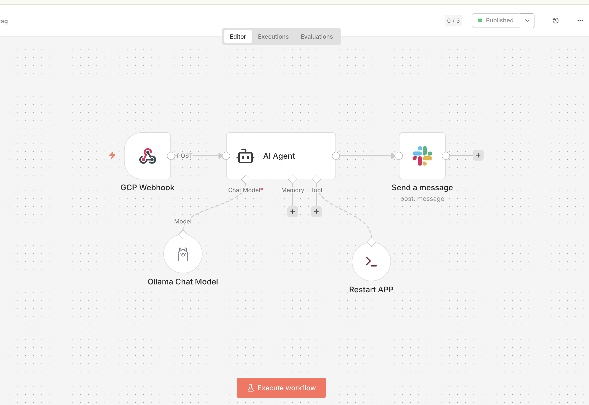

# 🛡️ Aegis AI: Autonomous SRE Agent

Aegis is a hybrid-cloud, self-healing MVP that monitors a local Node.js application using **GCP Managed Service for Prometheus**, analyzes incidents via a local **Ollama (Llama 3.1)** instance, and notifies/remediates via **n8n** and **Slack**.

---

## 🏗️ The Execution Flow

1.  **The Source (Node.js):** App generates custom metrics via `prom-client`.
2.  **The Transporter (Local Prometheus):** * Scrapes the Node.js app locally.
    * Uses `gcp-key.json` to **Remote Write** (push) metrics to GCP Cloud Monitoring.
3.  **The Watchman (GCP Monitoring):** * An **Alerting Policy** monitors the custom metrics in the GCP database.
    * On breach, GCP sends a Webhook to your **ngrok tunnel**.
4.  **The Orchestrator (n8n):**
    * Receives the alert via ngrok.
    * **Ollama Node** analyzes the JSON payload to identify root causes.
    * **Google Cloud Node** uses `gcp-key.json` to execute remediation (e.g., Restart Instance).
5.  **The Result (Slack):** Sends a summary and action report to your Slack workspace.

---

## 📁 Directory Structure
- `app/`: Node.js Express application with `prom-client`.
- `prometheus/prometheus.yml`: Configuration for scraping and Remote Write to GCP.
- `docker-compose.yaml`: Orchestration for the App and Prometheus.
- `gcp-key.json`: **(EXCLUDED)** GCP Service Account key with `Monitoring Metric Writer` and `Compute Admin` roles.

---

## 🚀 Setup Instructions

### 1. GCP Service Account Setup
- Create a Service Account (e.g., `aegis-agent`).
- **Roles Required:** - `roles/monitoring.metricWriter` (To push metrics).
    - `roles/compute.admin` (Optional: To allow n8n to "Heal/Restart" instances).
- Download the **JSON Key**, rename to `gcp-key.json`, and place in the root directory.
- **⚠️ Security:** Ensure `gcp-key.json` is added to your `.gitignore`.

### 2. Start the Monitoring Tunnel
```bash
# In Terminal 1
ngrok http 5678 --url=<YOUR_NGROK_DOMAIN>
```

### 3. Start the AI Orchestrator (n8n)
```bash
# In Terminal 2
export WEBHOOK_URL="https://<YOUR_NGROK_DOMAIN>/"
n8n start
```
*Ensure **Ollama** is running locally with `llama3.1` pulled.*



### 4. Run the Infrastructure
```bash
# In Terminal 3
docker-compose up -d
```

---

## 🧪 Testing the Flow

### Verify Telemetry
- **Local App Metrics:** `http://localhost:3000/metrics`
- **GCP Metrics Explorer:** Search for `prometheus.googleapis.com/app_critical_alert/gauge`.

### Trigger a Mock Incident
Use the provided script to flip the `app_critical_alert` metric from `0` to `1`.
```bash
./test-alert.sh trigger
```
Wait ~60s (as per GCP policy duration) to receive the AI analysis on Slack.

---

## 🛠 Tech Stack
- **Runtime:** Node.js (Express)
- **Observability:** Prometheus (GMP-compatible image)
- **Cloud:** Google Cloud Platform (Managed Prometheus & Monitoring)
- **AI/LLM:** Ollama (Llama 3.1 8B)
- **Automation:** n8n (Workflow Automation)
- **Tunneling:** ngrok