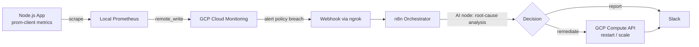

# Autonomous SRE Agent
 
A self-healing incident-response pipeline: it watches application metrics, uses an AI agent to reason about root cause when something breaks, and acts on that reasoning — restart the bad instance, notify the team, or draft a fix — without anyone getting paged awake to do it by hand.
 
This repo is a working MVP of that idea, built to run entirely on a laptop. The architecture is deliberately cloud-native at every seam, so the path from "runs on my machine" to "runs in production" is a series of swaps, not a rewrite — see [Production Scenario](#-production-scenario) below.
 
---
 
## 🏗️ Architecture
 

```mermaid
flowchart LR
    A[Node.js App<br/>prom-client metrics] -->|scrape| B[Local Prometheus]
    B -->|remote_write| C[GCP Cloud Monitoring]
    C -->|alert policy breach| D[Webhook via ngrok]
    D --> E[n8n Orchestrator]
    E -->|AI node: root-cause analysis| F{Decision}
    F -->|remediate| G[GCP Compute API<br/>restart / scale]
    F -->|report| H[Slack]
    G --> H
```
 
**The flow, step by step:**
 
1. **Source (Node.js):** the app exposes custom metrics via `prom-client`.
2. **Transporter (local Prometheus):** scrapes the app, then uses `gcp-key.json` to remote-write those metrics into GCP Cloud Monitoring. Push, not pull — the same config works whether Prometheus lives on your laptop or in a cluster.
3. **Watchman (GCP Monitoring):** an alerting policy watches the metric stream. On breach, it fires a webhook.
4. **Orchestrator (n8n):** receives the alert, hands the payload to an AI agent node for root-cause analysis, then acts — calling the GCP Compute API to remediate, or just reporting.
5. **Result (Slack):** either way, a summary lands in Slack so a human sees what happened and what was done about it.
The alerting and remediation logic is decoupled from the LLM behind it — n8n's AI node is a swappable component, not the center of the design. Locally it points at Ollama so the whole thing runs with zero API cost; in production it's a one-line swap to a hosted model (more on that below).
 
---
 
## 🌍 Production Scenario
 
This MVP intentionally uses local, free, zero-config pieces (Ollama, ngrok, a JSON key on disk) so anyone can clone it and see the whole loop fire in minutes. None of those choices are load-bearing to the architecture — here's what changes to run this for real:
 
- **Alert ingestion:** replace the ngrok tunnel with a stable public endpoint — a Cloud Run service or Cloud Function behind the webhook, or push alerts through Pub/Sub instead of an inbound HTTP call. Removes the single point of failure of a laptop tunnel and gives you retry semantics for free.
- **Orchestration:** move from local n8n to n8n Cloud, a self-hosted instance behind auth, or a small dedicated worker service if you want to own the code path fully. Either way, workflows should run on infrastructure that doesn't go to sleep when a laptop lid closes.
- **AI reasoning:** swap the Ollama node for a hosted model (Claude, GPT, Gemini) so root-cause analysis has more context window and better reasoning on ambiguous incidents — a straightforward endpoint swap in the same n8n node, no pipeline changes.
- **Credentials:** replace `gcp-key.json` on disk with a secrets manager (GCP Secret Manager, Vault, etc.) and workload identity federation instead of a long-lived key file.
- **Least privilege:** scope the service account down from `roles/compute.admin` (project-wide) to `roles/compute.instanceAdmin.v1` on the specific instances the agent is allowed to touch. Broad admin access is fine for a demo; it's not something you'd want an LLM-triggered action holding in prod.
- **Remediation depth:** beyond restarting an instance, the same agent can open a pull request with a proposed code fix and post it to Slack for human-in-the-loop approval before merge — turning this from "auto-restart" into an actual triage assistant.
- **Auditability:** log every AI decision (prompt, response, action taken) somewhere durable, so remediation actions are reviewable after the fact — important once the agent is allowed to touch real infrastructure.
---
 
## 📁 Directory Structure
 
- `app/` — Node.js Express application instrumented with `prom-client`.
- `prometheus/prometheus.yml` — scrape config and GCP remote-write target.
- `docker-compose.yaml` — orchestration for the app and Prometheus.
- `gcp-key.json` — **(excluded from git)** GCP service account key. See [Setup](#-setup-instructions).
- `policy.json` — GCP alerting policy configuration.
- `test-alert.sh` — triggers or resolves the mock critical alert.
---
 
## 🚀 Setup Instructions
 
### 1. GCP service account
 
- Create a service account (e.g. `aegis-agent`).
- Grant `roles/monitoring.metricWriter` (to push metrics) and, optionally, `roles/compute.admin` (to let n8n restart instances — see the least-privilege note above for what to use instead in production).
- Download the JSON key, rename it to `gcp-key.json`, and place it in the repo root.
- **Make sure `gcp-key.json` is in `.gitignore`** before you commit anything.
### 2. Open a tunnel for the alert webhook
 
```bash
# Terminal 1
ngrok http 5678 --url=<YOUR_NGROK_DOMAIN>
```
 
### 3. Start the orchestrator (n8n)
 
```bash
# Terminal 2
export WEBHOOK_URL="https://<YOUR_NGROK_DOMAIN>/"
n8n start
```
 
The AI node is configured to call a local Ollama instance (`llama3.1`) by default, so the whole pipeline runs without any API keys or cost. Point it at a hosted model instead if you want production-grade reasoning — see [Production Scenario](#-production-scenario).
 
### 4. Start the app + Prometheus
 
```bash
# Terminal 3
docker-compose up -d
```
 
---
 
## 🧪 Testing the Flow
 
**Verify telemetry is flowing:**
 
- Local app metrics: `http://localhost:3000/metrics`
- GCP Metrics Explorer: search for `prometheus.googleapis.com/app_critical_alert/gauge`
**Trigger and resolve a mock incident:**
 
```bash
./test-alert.sh trigger   # flips app_critical_alert from 0 to 1
./test-alert.sh resolve   # flips it back to 0
```
 
After triggering, wait roughly 60 seconds (the GCP alert policy's duration window) for the AI analysis to land in Slack.
 
---
 
## 🛠 Tech Stack
 
- **Runtime:** Node.js (Express)
- **Observability:** Prometheus (GMP-compatible)
- **Cloud:** Google Cloud Platform (Managed Prometheus & Monitoring)
- **Orchestration:** n8n
- **AI/LLM:** Ollama (Llama 3.1) locally — swappable for Claude, GPT, or Gemini via the same n8n node
- **Tunneling (local dev only):** ngrok
